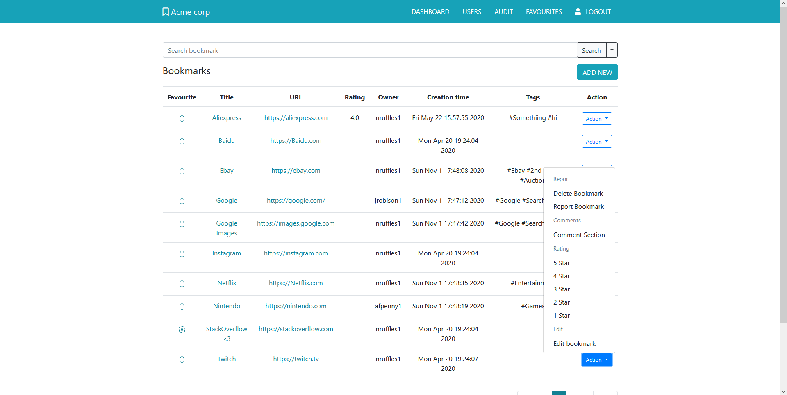

# Acme Corp Bookmark Manager
This application is a bookmark management tool, suited for small to medium sized organizations. 
Logged users have their bookmarks stored in the cloud, while guests can access most needed resources without logging in.
Bookmarks can be marked as favourite, commented upon, rated, reported and equipped with tags.
Administrators supervision and management of users and reports ensures the quality of user experience for all users.



## Getting Started

These instructions will get you a copy of the project up and running on your local machine for development and testing purposes. See deployment for notes on how to deploy the project on a live system.

### Installing

#### With Docker (recommended)
Build the container with
```bash
$ docker build -t "bookmark-manager" .
```

Then start the container
```bash
$ docker run -p 4567:4567 bookmark-manager
```

Access the website from `http://127.0.0.1:4567`

#### Installing manually


#### Prerequisites

What things you need to install the software and how to install them

```
Linux operating system
Bundler (developed with version 2.1.4)
Ruby language package (developed with version 2.6.5p114)
```

There was no testing on other platforms, so the developers cannot promise functionality with other configurations.

#### Installation

All gem dependencies are installed with Bundler:

```
sudo gem install bundler
sudo bundle install
```

Once this has completed, you should have the required gems to start the server
To start the server, enter the following command:

```
ruby startServer.rb
```

This should start the server up on `port 4567`.

In order to log in to the website, you can either make your own account (As a standard user) or you could try logging into one of the pre-made accounts with the username and password:

```creds
Username: role1   Email: role1@acme.com   Password: Password1!
Username: role2   Email: role2@acme.com   Password: Password1!
Username: role3   Email: role3@acme.com   Password: Password1!
Username: role4   Email: role4@acme.com   Password: Password1!
Username: admin   Email: admin@acme.com   Password: Password1!
Username: user    Email: user@acme.com    Password: Password1!
```

The username or the email can be used to log in to the website.

For further information about accounts and their permissions, navigate to `/admin/users` as an admin, this should give 
you access to the whole website as an admin.

## Running the tests

Open the `Gemfile` in the root directory and uncomment the testing gems.

Navigate to the project directory then run `bundle install` to install the required gems.

We use `cucumber` command to run all the tests.

- `cucumber features/specific_test.feature` if there is a need to test a specific feature in isolation. 

- `cucumber features/specific_test.feature --name "Scenario name" ` if testing specific scenario in a feature
Then navigate to the coverage directory. There is a test report from the last run as an index.html file. 

The tests for `make_bookmarks.feature` will create some test-purpose bookmarks, which you can then safely delete.

### Break down into end to end tests

These tests check whether the user interaction proceeds as expected, handling inputs and producing outputs.

For example, running `cucumber features/register.feature` outputs results of different scenarios for user input.
The test then expects certain outputs, such as `password too short` if `123` is entered into the password field

## Built With

* [Sinatra](http://sinatrarb.com/intro.html) - The web framework used
* [SQLite3](https://rubygems.org/gems/sqlite3/versions/1.3.11) - Database management
* [OpenSSL](https://docs.ruby-lang.org/en/2.1.0/OpenSSL.html) - Used to generate hashes for passwords
* [Cucumber](https://cucumber.io/) - Main testing tool
* [Capybara](https://github.com/teamcapybara/capybara) - Automation helper tool
* [RSpec](https://rspec.info/) - Automation helper tool
* [Coffee] - We just drink coffee...

## Authors

* **Jake Robison** - *Primary Backend programming, Primary Database*
* **Nicholas Ruffles** - *Secondary Backend programming, Primary Security*
* **Anna Penny** - *Coordination, Client contact, Secondary Backend, Secondary Security*
* **Stanislaw Malinowski** - *Primary Testing, Scrum Master, Secondary Frontend*
* **Lujain Hawsawi** - *Frontend programming, Secondary Testing, Secondary Version control*
* **Abdulrahman	Alterkait** - *Frontend programming, Secondary Database*

See also the list of [contributors](https://github.com/TheDarthMole/Bookmarks-Manager/graphs/contributors) who participated in this project.

